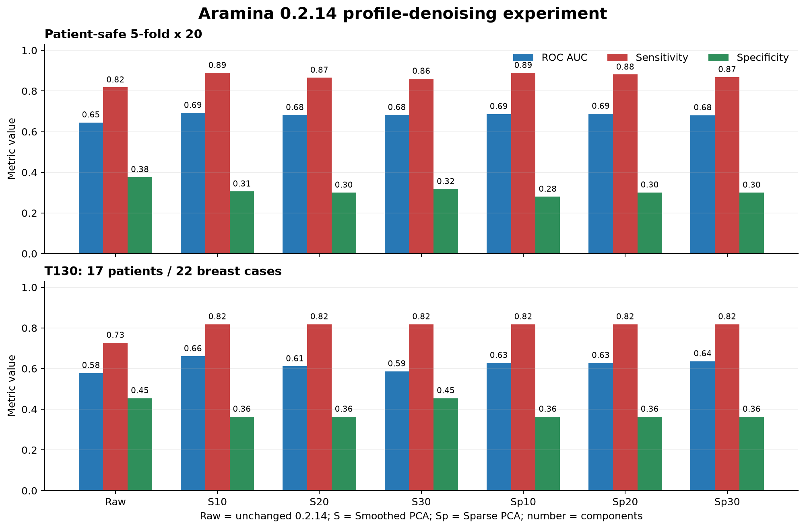

# Aramina 0.2.14 profile-denoising experiment

## Purpose

This controlled experiment tests whether principal-component reconstruction can
remove measurement-level profile noise without reducing patient-safe model
performance. It does not replace the Aramina 0.2.14 product model.

## Fixed product elements

- Input cohort and accepted measurements are identical to Aramina 0.2.14.
- Dataset fingerprint is
  `8ffb7957ca057fe2e3a7b3c149ba118d34bc2d924dbaddaecebb88caadc396e5`;
  source H5 SHA256 is
  `d2d61e83850b282c3d2479ea436deed821c4488b96983252d294f3d56ee3f1f9`.
- Raw profiles contain 100 aligned q bins.
- Labels, target-breast case construction, LR1 and LR2 regularization, age,
  optional Core4 symmetry, and the 0.95 target-sensitivity threshold rule are
  unchanged.
- `p_cancer` remains the model probability.
- Clinical stage remains research draft; output is decision support and is not
  an autonomous diagnosis.

## Compared representations

`raw_100_baseline` uses the unchanged product profile. Smoothed PCA reconstructs
each profile in a roughness-penalized component basis. Sparse PCA reconstructs
each profile from L1-sparse components. Component counts 10, 20, and 30 are
predeclared for both denoisers. Denoised profiles retain 100 q positions, so the
downstream Aramina architecture is unchanged.

## Leakage control

One repeated stratified patient-safe split manifest is generated and reused for
every method. For each split, the denoiser is fitted on all accepted measurements
from training patients only. It then transforms training and held-out patient
measurements. A patient cannot contribute measurements to both partitions.

## Evidence

Primary evidence is 5-fold repeated patient-safe cross-validation with 20
repeats. Reported metrics include ROC AUC, sensitivity, specificity, balanced
accuracy, PPV, NPV, confusion counts, and the fold-specific decision threshold.
Profile RMSE, relative L2 reconstruction error, roughness ratio, and negative
reconstruction fraction describe the physical effect of denoising.

The existing T130 quality-challenging demonstration subset provides one
additional check on 17 patients and 22 breast cases. It was not used for model
fitting. Its small size and quality-based selection do not make it a formal
independent validation cohort.

Train-on-all artifacts are generated for technical comparison only. Their
metrics are in-sample and are not independent validation. No experimental
artifact is eligible for product promotion without review and a separate model
decision.

## Run

```bash
aramina experiment-pca-denoising \
  --config config/experiments/config_0_2_14_pca_denoising.yaml
```

## Results



The raw baseline exactly reproduced the recorded Aramina 0.2.14 patient-safe
metrics. This confirms that cohort construction, folds, LR1/LR2 models, and the
threshold rule were preserved.

| Representation | ROC AUC | Sensitivity | Specificity | Balanced accuracy |
|---|---:|---:|---:|---:|
| Raw 100-bin baseline | 0.645 +/- 0.069 | 0.818 +/- 0.099 | 0.376 +/- 0.133 | 0.597 |
| Smoothed PCA 10 | 0.692 +/- 0.070 | 0.889 +/- 0.086 | 0.306 +/- 0.105 | 0.597 |
| Smoothed PCA 20 | 0.682 +/- 0.075 | 0.866 +/- 0.108 | 0.300 +/- 0.105 | 0.583 |
| Smoothed PCA 30 | 0.682 +/- 0.075 | 0.860 +/- 0.100 | 0.317 +/- 0.105 | 0.589 |
| Sparse PCA 10 | 0.687 +/- 0.073 | 0.889 +/- 0.081 | 0.280 +/- 0.105 | 0.585 |
| Sparse PCA 20 | 0.688 +/- 0.072 | 0.881 +/- 0.091 | 0.301 +/- 0.114 | 0.591 |
| Sparse PCA 30 | 0.681 +/- 0.070 | 0.868 +/- 0.091 | 0.300 +/- 0.114 | 0.584 |

Every denoiser increased mean patient-safe ROC AUC by `0.036-0.047` and
sensitivity by `0.043-0.071`. Specificity decreased by `0.059-0.096`.
Consequently, balanced accuracy did not improve: Smoothed PCA 10 changed it by
only `+0.0004`, while the other denoisers reduced it.

| Representation | Relative L2 error | Roughness ratio | Negative values |
|---|---:|---:|---:|
| Smoothed PCA 10 | 0.0257 | 0.0830 | 0.0000 |
| Smoothed PCA 20 | 0.0234 | 0.0976 | 0.0000 |
| Smoothed PCA 30 | 0.0214 | 0.1389 | 0.0000 |
| Sparse PCA 10 | 0.0276 | 0.1558 | 0.0000 |
| Sparse PCA 20 | 0.0244 | 0.3293 | 0.0000 |
| Sparse PCA 30 | 0.0222 | 0.4720 | 0.0000 |

The reconstructions changed total profile geometry by only `2.1-2.8%` in
relative L2 norm, but removed `53-92%` of second-difference roughness. No method
generated negative intensity values.

Train-on-all ROC AUC was `0.865` for raw profiles and `0.771-0.801` after
denoising. The gap between train-on-all and patient-safe ROC AUC decreased from
`0.220` for raw profiles to `0.079` for Smoothed PCA 10 and `0.119` for Smoothed
PCA 30. This is consistent with regularization of high-frequency cohort-specific
structure, but it does not by itself prove that the removed structure is noise.

## T130 check

| Representation | ROC AUC | Sensitivity | Specificity | FN | FP |
|---|---:|---:|---:|---:|---:|
| Raw 100-bin baseline | 0.579 | 0.727 | 0.455 | 3 | 6 |
| Smoothed PCA 10 | 0.661 | 0.818 | 0.364 | 2 | 7 |
| Smoothed PCA 20 | 0.612 | 0.818 | 0.364 | 2 | 7 |
| Smoothed PCA 30 | 0.587 | 0.818 | 0.455 | 2 | 6 |
| Sparse PCA 10 | 0.628 | 0.818 | 0.364 | 2 | 7 |
| Sparse PCA 20 | 0.628 | 0.818 | 0.364 | 2 | 7 |
| Sparse PCA 30 | 0.636 | 0.818 | 0.364 | 2 | 7 |

Smoothed PCA 30 removed one false negative without adding a false positive on
T130. One case changes sensitivity or specificity by `9.1` percentage points,
so this observation is directional only.

## Decision

Aramina 0.2.14 remains unchanged. Denoising improves ranking and sensitivity,
but the current target-sensitivity threshold rule converts that gain into lower
specificity on patient-safe folds. Sparse PCA provides no advantage over
Smoothed PCA and is substantially slower. Smoothed PCA 30 is the preferred
follow-up candidate because it preserves more profile structure and produced
the best T130 confusion matrix. It requires a controlled smoothing-penalty scan
and evaluation on a larger independently collected cohort before any product
decision.
