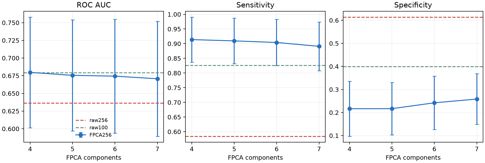
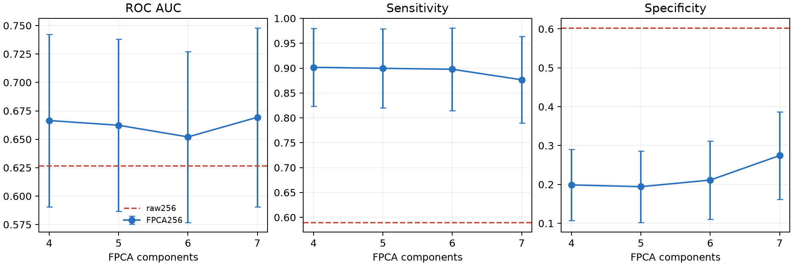

# FPCA256 profile encoder results

Research-only result. No model is promoted and no product contract is changed.

## Evaluation design

- Patient-safe repeated stratified 5-fold x20 evaluation: 100 outer test folds.
- PCA, LR1, LR2, and threshold are fitted using each outer-training partition.
- Threshold targets 0.95 sensitivity on outer-training scores; held-out
  sensitivity is measured, not guaranteed.
- LR2 architecture and regularization are fixed. Changing npt changes both the
  LR1 profile representation and profile-derived Core4 symmetry values.
- Train-on-all metrics are in-sample descriptions, not independent validation.
- Runtime provenance is pinned to `pyFAI==2026.5.0` and the inspected
  `integrate1d` default `("bbox", "csr", "cython")`, recorded as
  `pyfai_integrate1d_default`.

The existing input artifacts were independently regenerated from the source H5
under this pinned PyFAI default. The regenerated dataframes and downstream
metrics matched the pinned artifacts exactly.

## Controlled common cohort

The raw100 and npt256 artifacts contain the same 803 measurements, 161
patients, and 164 target-breast cases. This is the only cohort supporting a
direct raw100 comparison.

| Encoder | ROC AUC, fold mean +/- SD | Sensitivity | Specificity |
|---|---:|---:|---:|
| raw100 | 0.679 +/- 0.076 | 0.826 | 0.400 |
| raw256 | 0.636 +/- 0.079 | 0.585 | 0.614 |
| FPCA256, 4 | 0.680 +/- 0.078 | 0.914 | 0.216 |
| FPCA256, 5 | 0.676 +/- 0.078 | 0.910 | 0.217 |
| FPCA256, 6 | 0.674 +/- 0.080 | 0.904 | 0.242 |
| FPCA256, 7 | 0.671 +/- 0.081 | 0.891 | 0.258 |

FPCA4-7 forms a practical ROC plateau. Relative to raw100, mean paired ROC
deltas range from +0.001 for FPCA4 to -0.008 for FPCA7. FPCA therefore does not
beat the current raw100 representation. It shifts the thresholded operating
point toward higher sensitivity and lower specificity.

The paired 2.5% and 97.5% fold-delta quantiles cross zero for every FPCA versus
raw100 ROC comparison. These are descriptive quantiles, not inferential
confidence intervals, because repeated folds overlap.

## Full npt256 cohort

The full npt256 artifact contains 876 measurements, 163 patients, and 171
target-breast cases.

| Encoder | ROC AUC, fold mean +/- SD | Sensitivity | Specificity |
|---|---:|---:|---:|
| raw256 | 0.627 +/- 0.086 | 0.590 | 0.603 |
| FPCA256, 4 | 0.666 +/- 0.076 | 0.902 | 0.199 |
| FPCA256, 5 | 0.662 +/- 0.076 | 0.900 | 0.194 |
| FPCA256, 6 | 0.652 +/- 0.075 | 0.898 | 0.211 |
| FPCA256, 7 | 0.669 +/- 0.079 | 0.877 | 0.274 |

FPCA4-7 again shows no monotonic convergence benefit. Mean ROC is similar
across component counts, while sensitivity decreases and specificity increases
as components are added. This is an operating-point tradeoff, not evidence for
selecting one component count.

## Variance representation

Four components explain 94.2% of train-on-all profile variance in the common
cohort and 94.6% in the full cohort. Seven components explain 95.1% and 95.3%,
respectively. Most profile variance is therefore compressed into four
components, but variance reconstruction alone does not establish better cancer
decision support.

## Conclusion

FPCA256 provides a compact and reproducible LR1 representation, but does not
improve patient-safe ROC over raw100 on the matched common cohort. Component
counts 4-7 are a ROC plateau with a sensitivity/specificity tradeoff. No model
selection or product promotion is supported by this experiment.

The frozen readable footprint, including fold metrics, patient-safe manifests,
paired deltas, PCA variance, basis loadings, and plots, is available in
[`results/`](results/README.md).
