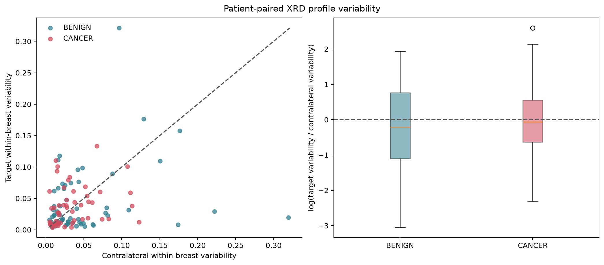
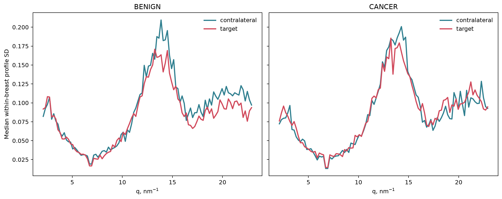

# Target versus Contralateral Profile Variability: Results

## Fixed analysis

- Input: frozen T100 model-input joblib with normalized 100-point profiles.
- Primary cohort: unilateral-biopsy patients with three unique target and three
  unique contralateral positions.
- Cases: 115 patients; 62 BENIGN and 53 CANCER target breasts.
- Primary metric: mean pairwise squared profile distance over the complete
  `2.105–22.895 nm^-1` product profile.
- Patient effect: geometric mean of the paired target/contralateral variability
  ratio.

## Primary result

| Group | Cases | Target/contralateral ratio | Bootstrap 95% CI | Paired p-value | Target more variable |
|---|---:|---:|---:|---:|---:|
| All | 115 | 0.895 | 0.730–1.099 | 0.292 | 45.2% |
| BENIGN | 62 | 0.808 | 0.602–1.076 | 0.161 | 43.5% |
| CANCER | 53 | 1.009 | 0.771–1.340 | 0.948 | 47.2% |

The primary analysis does not show a statistically supported difference in
within-breast profile variability between target and contralateral sampling.
The CANCER-versus-BENIGN difference in paired log ratios was `0.223` (bootstrap
95% CI `-0.171–0.635`; diagnosis-label permutation `p=0.295`). Thus, the data
also do not support a diagnosis-specific variability difference.

## Robustness checks

Allowing at least two rather than exactly three retained positions produced
130 paired cases and the same conclusion: overall ratio `0.905`, bootstrap 95%
CI `0.746–1.095`, paired `p=0.314`.

Secondary definitions based on RMS, cosine distance, Wasserstein distance and
the `7–15`, `15–23`, and `7–23 nm^-1` ranges produced no significant result
after Benjamini-Hochberg correction. Aggregate values are stored in
[`secondary_metrics.csv`](outputs/primary_3x3/secondary_metrics.csv).

## Interpretation

The current measurements do not demonstrate that the three nearby target
points are systematically more or less variable than the three more widely
separated contralateral points. This is a negative result, not proof that both
sampling schemes are equivalent; the confidence intervals still allow modest
differences.

Only P1/P2/P3 labels are available. Physical coordinates and distances between
measurement points were not recorded. Breast role and sampling geometry are
therefore confounded. The result describes **protocol-conditioned
variability** and cannot separate spatial-distance effects from tissue effects.

A prospective geometry experiment should acquire both nearby and widely
separated triplets on both breasts and store physical or breast-normalized
coordinates. That crossed design is required to estimate intrinsic spatial
heterogeneity independently of target/contralateral role.

## Figures

