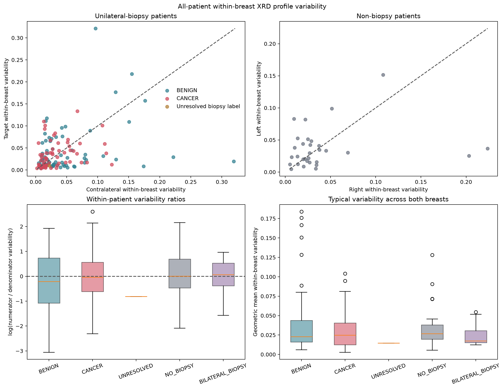

# All-Patient Within-Breast Profile Variability

## Question

Does the within-breast variability of normalized XRD profiles differ between
the biopsy and non-biopsy parts of the archive when the historical AgBH/K-beta
exclusion is not applied?

This is a descriptive data-variability experiment. It does not train, tune or
validate an Aramina classifier.

## Input and eligibility

- Input: complete combined H5 archive; SHA-256
  `d2d61e83850b282c3d2479ea436deed821c4488b96983252d294f3d56ee3f1f9`.
- Historical K-beta exclusion: disabled.
- Biopsy-patient filter: disabled.
- Technical preprocessing remains active: PONI geometry, thickness controls,
  faulty-pixel handling, azimuthal integration, SNR filtering, normalization
  and profile gate.
- `226` patients remain after those technical steps.
- `215` have both left and right breasts.
- `177` have both breasts and at least three unique positions per breast; only
  these patients support the paired comparison.

## Cohorts

| Cohort | Patients | Comparison |
|---|---:|---|
| Unilateral biopsy, BENIGN | 72 | target / contralateral |
| Unilateral biopsy, CANCER | 62 | target / contralateral |
| Biopsy label unresolved | 1 | target / contralateral; not relabelled |
| No biopsy | 31 | left / right only |
| Bilateral biopsy | 11 | left / right; separate descriptive cohort |

The no-biopsy patients have no clinical target breast. `Left/Right` is a fixed
orientation solely for calculating a signed paired ratio; interchanging sides
would invert that ratio but would not change the magnitude of disagreement.

## Metric

For each breast, variability is the mean pairwise squared distance between
already normalized profiles across the full common q-grid
`2.105-22.895 nm^-1`. The patient-level comparison is the log ratio of the
two breast variabilities. A ratio of one means equal variability.

## Results

| Cohort | Median paired ratio | Geometric mean ratio | Bootstrap 95% CI |
|---|---:|---:|---:|
| BENIGN target / contralateral | 0.811 | 0.808 | 0.622-1.053 |
| CANCER target / contralateral | 0.965 | 1.015 | 0.788-1.303 |
| No biopsy left / right | 1.002 | 1.033 | 0.725-1.448 |
| Bilateral biopsy left / right | 1.067 | 0.944 | 0.605-1.424 |

The no-biopsy left/right result is centred near one and has a wide confidence
interval. It shows no apparent systematic left/right variability difference in
this small eligible non-biopsy cohort. The biopsy cohort remains compatible
with the earlier conclusion: CANCER target/contralateral variability is near
equal on average, while the BENIGN estimate is lower but its interval crosses
one.

## Limitation

Target points are sampled inside the suspicious region, whereas contralateral
points are spatially more separated. Physical coordinates are not available.
Therefore target/contralateral estimates remain conditioned on the historical
measurement protocol and cannot isolate tissue biology from point geometry.
The non-biopsy left/right analysis is an additional reference comparison, not a
solution to that geometry confounding.

